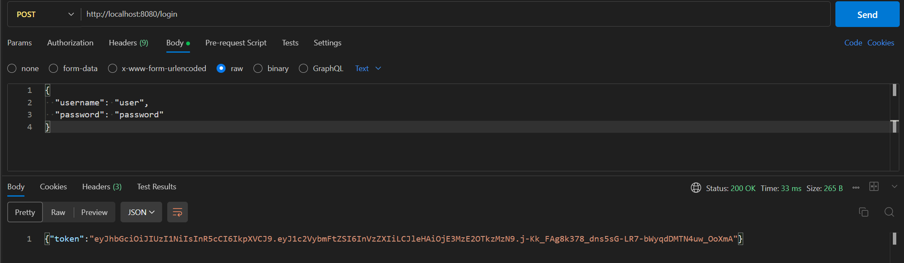
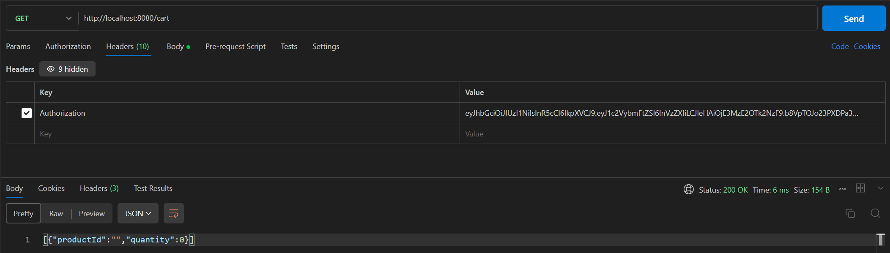
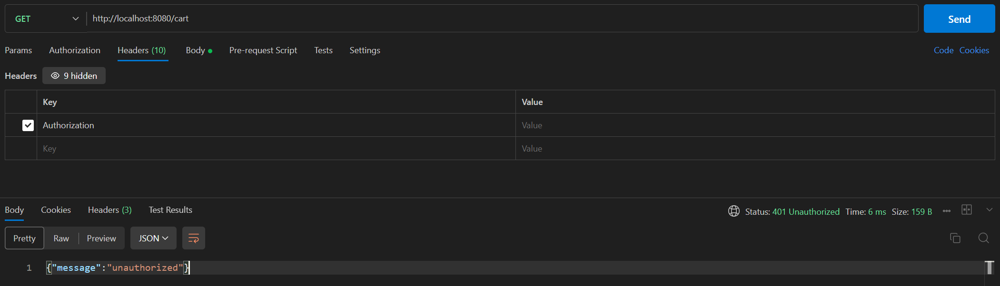
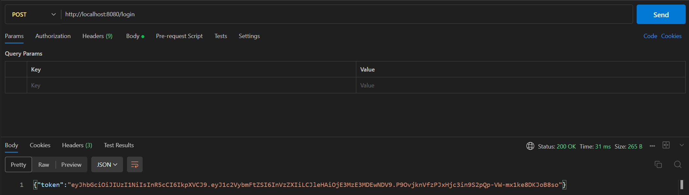
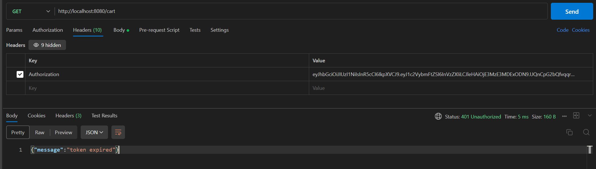
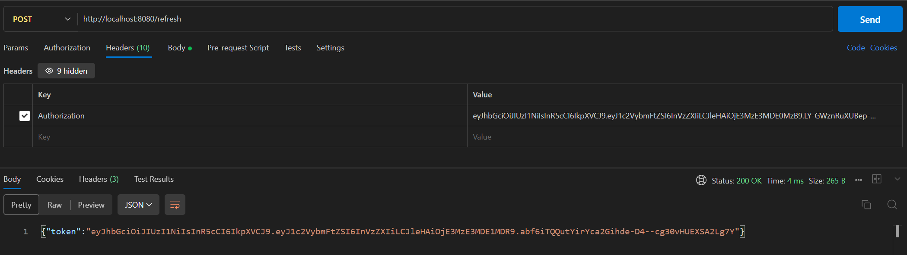
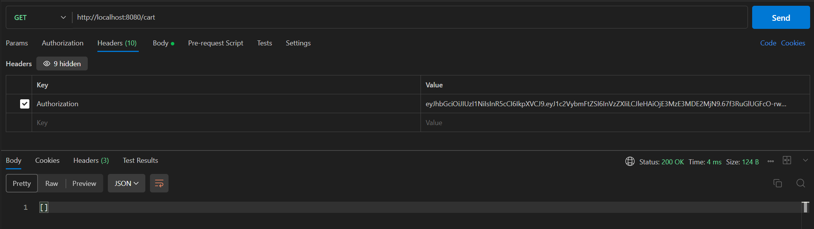

# industrialTechnology  
Практические занятия по предмету "Технологии индустриального программирования" 1 семестр.  
Автор: Балуева Мария, ЭФМО-02-24  

## Практика 9
## Аутентификация и авторизация в REST API.  
Ссылка на код: https://github.com/MarBalueva/industrialTechnology/blob/pr8/main.go  

### 9.1. Получение токена  
POST http://localhost:8080/login  
  

### 9.2. Получение продуктов из корзины  
GET http://localhost:8080/cart  
  

### 9.3. Получение продуктов из корзины неавторизованным пользователем  
GET http://localhost:8080/cart  
  

### 9.4. Получение нового токена  
POST http://localhost:8080/login  
  

### 9.5. Проверка срока действия токена  
GET http://localhost:8080/cart  
  

### 9.6. Запрос рефреша токена  
POST http://localhost:8080/refresh  
  

### 9.7. Проверка нового токена
GET http://localhost:8080/cart  
  