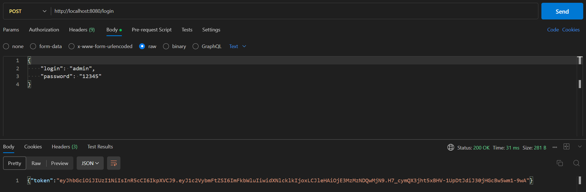
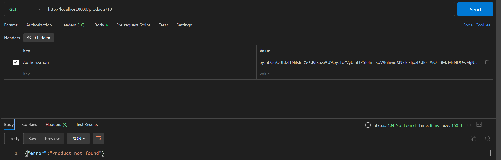
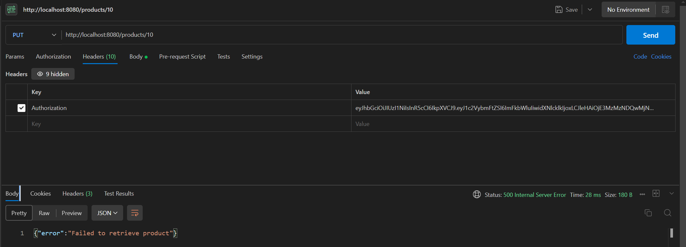
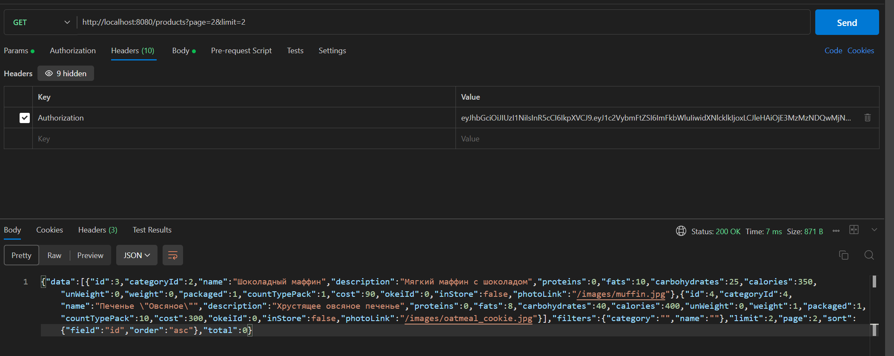
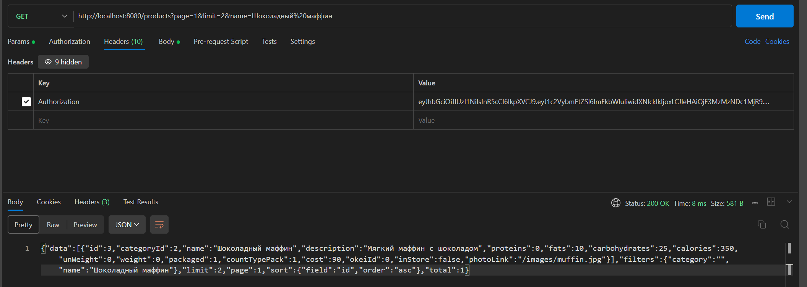
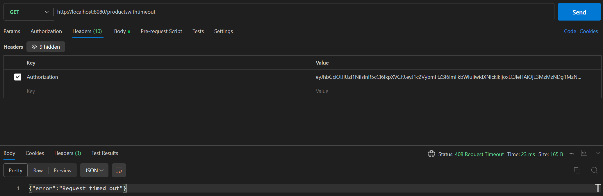
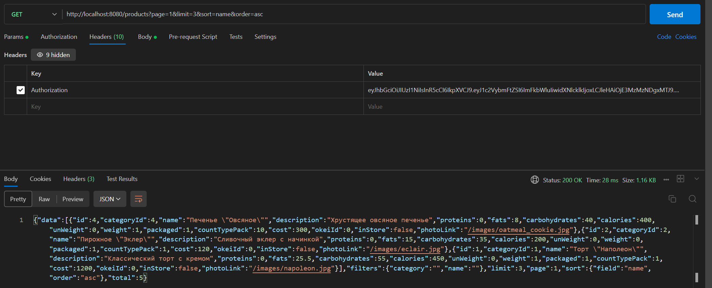
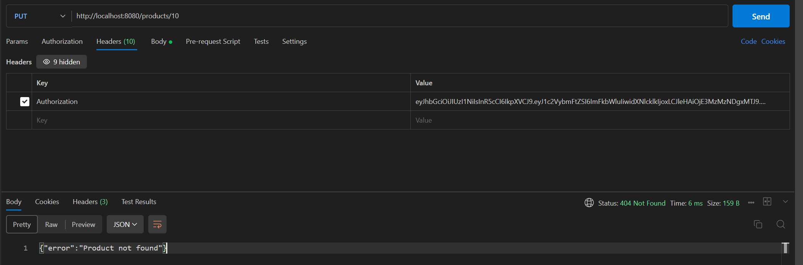

# industrialTechnology  
Практические занятия по предмету "Технологии индустриального программирования" 1 семестр.  
Автор: Балуева Мария, ЭФМО-02-24  

## Практика 12
## Обработка ошибок, пагинация и фильтрация данных в REST API
Ссылка на код: https://github.com/MarBalueva/industrialTechnology/blob/pr12/main.go  

### 12.1. Получение токена  
POST http://localhost:8080/login  
  

### 12.2. Обработка ошибок в CRUD-функциях
GET http://localhost:8080/products/10  
  

PUT http://localhost:8080/products/10  
  

### 12.3. Пагинация данных
GET http://localhost:8080/products?page=2&limit=2  
  

### 12.4. Фильтрация данных  
GET http://localhost:8080/products?page=1&limit=2&name=Шоколадный%20маффин  

### 12.5. Использование контекста запроса для тайм-аутов  
GET http://localhost:8080/productswithtimeout  
  

### 12.6. Сортировка данных  
GET http://localhost:8080/products?page=1&limit=3&sort=name&order=asc  
  

### 12.7. Gопытка обновления несуществующего ресурса  
PUT http://localhost:8080/products/10  
  