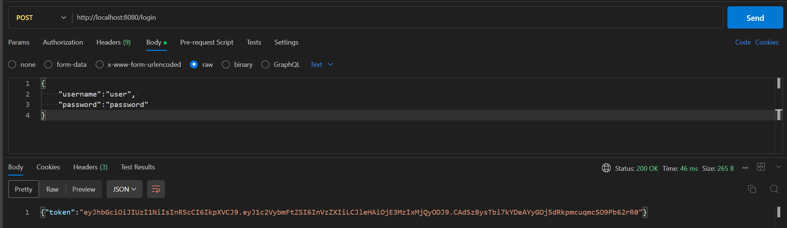
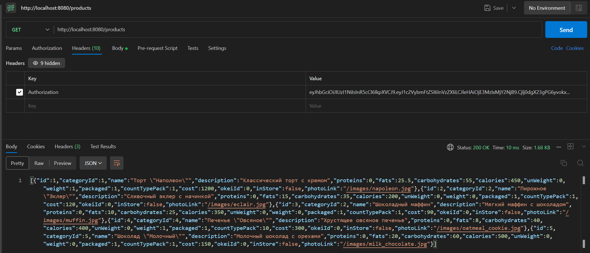
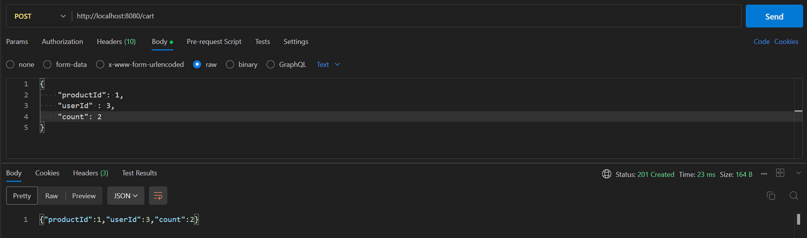
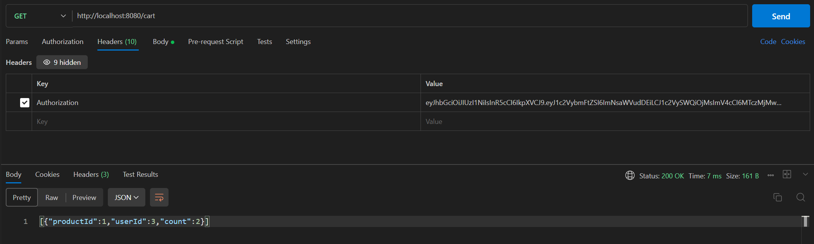
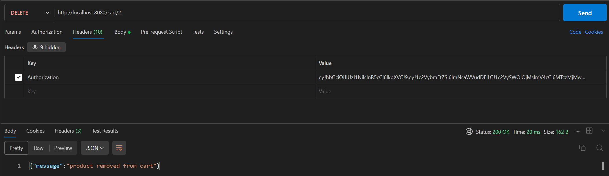
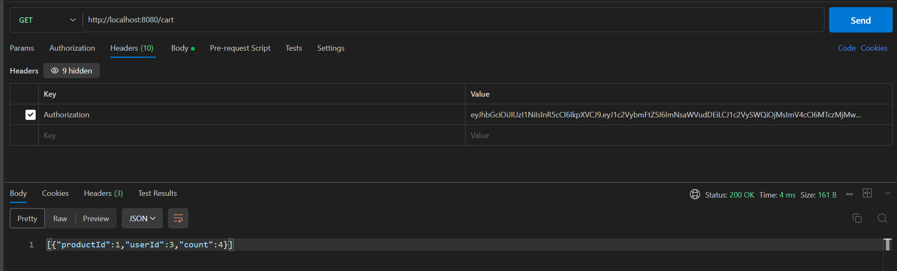

# industrialTechnology  
Практические занятия по предмету "Технологии индустриального программирования" 1 семестр.  
Автор: Балуева Мария, ЭФМО-02-24  

## Практика 11
## Интеграция REST API с базой данных (PostgreSQL) на Go
Ссылка на код: https://github.com/MarBalueva/industrialTechnology/blob/pr9/main.go 

### 11.1. Получение токена  
POST http://localhost:8080/login  
  

### 11.2. Получение всех продуктов  
GET http://localhost:8080/cart  
  

### 11.3. Добавление продукта в корзину  
POST http://localhost:8080/cart  
  

### 11.4. Получение продуктов из корзины  
GET http://localhost:8080/cart  
  

### 11.5. Удаление продукта из корзины  
DELETE http://localhost:8080/cart/2  
  

### 11.6. Перезаход и получение продуктов из корзины  
GET http://localhost:8080/cart  
  
