# industrialTechnology  
Практические занятия по предмету "Технологии индустриального программирования" 1 семестр.  
Автор: Балуева Мария, ЭФМО-02-24  

## Практика 8  
## Создание простого REST API на языке Go с использованием фреймворка Gin.  

### 8.1. Получение всех продуктов  
GET http://localhost:8080/products  
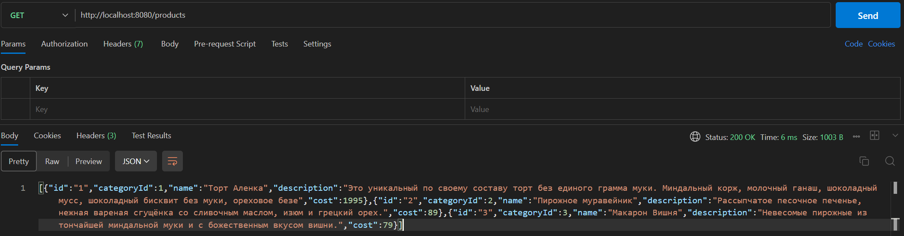  

### 8.2. Получение продукта по ID  
GET http://localhost:8080/products/1  
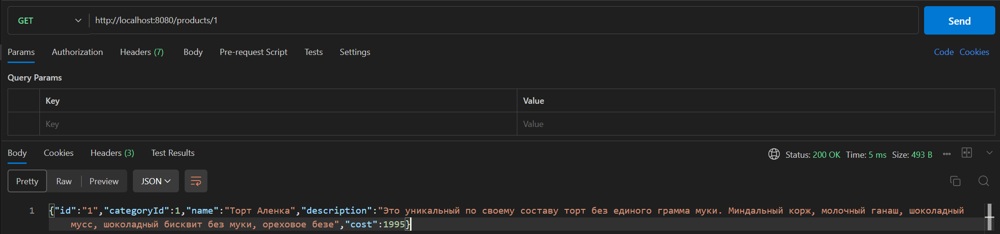  

### 8.3. Создание нового продукта
POST http://localhost:8080/products  
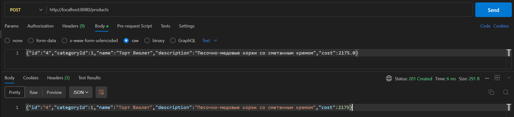  

GET http://localhost:8080/products/4  
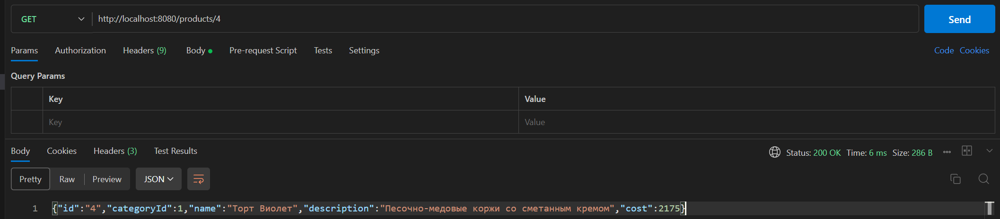  

### 8.4. Обновление существующего продукта
PUT http://localhost:8080/products/4  
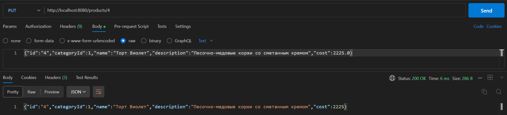  

GET http://localhost:8080/products/4  
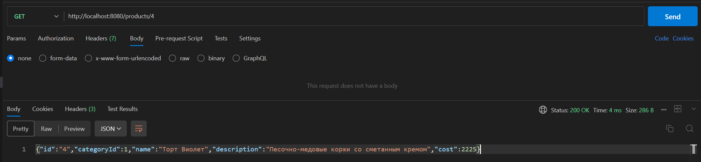  

### 8.5. Удаление продукта
DELETE http://localhost:8080/products/4  
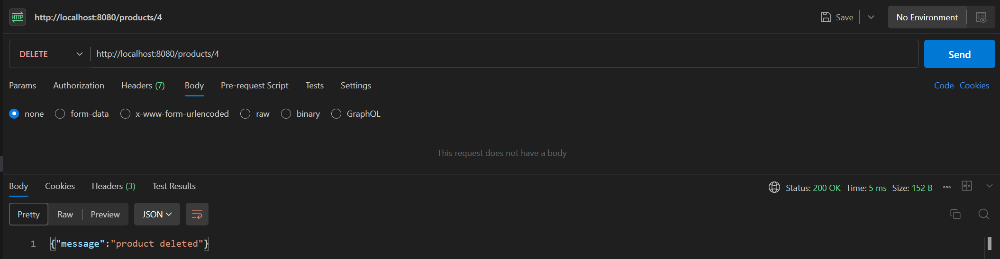  

GET http://localhost:8080/products/4  
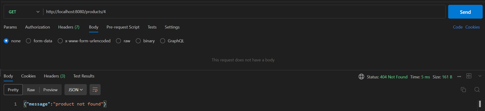  

## Работа с корзиной

### 8.6. Получение всех продуктов в корзине  
GET http://localhost:8080/cart  
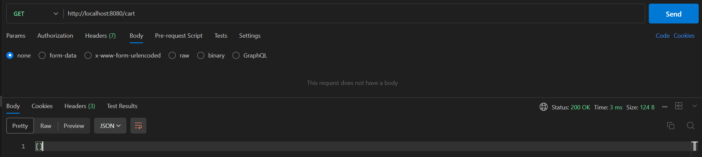  

### 8.7. Добавление продукта в корзину
POST http://localhost:8080/cart  
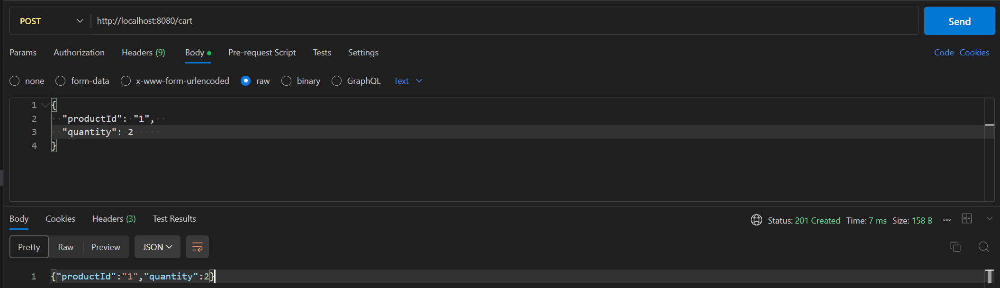  

GET http://localhost:8080/cart  
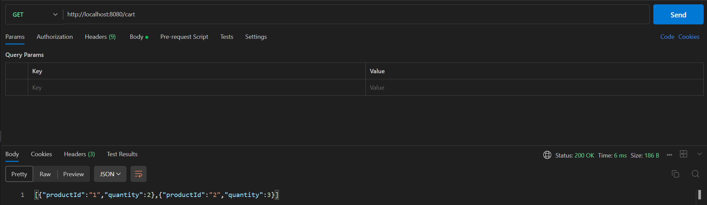  

### 8.8. Удаление продукта из корзины
DELETE http://localhost:8080/cart/2  
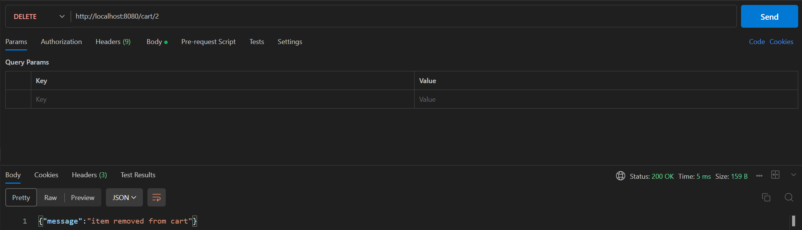  

GET http://localhost:8080/cart  
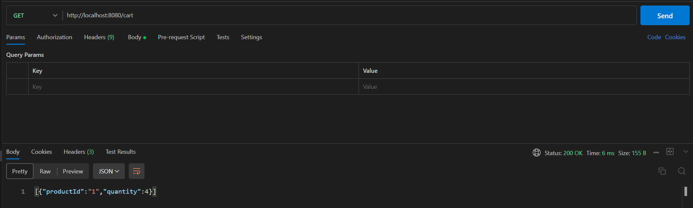  